# <div align="center"></div>

<div align="center">
  
[](https://linkedin.com/in/engabdalrahamanmuhammad)
[](mailto:abdelrhmanmohamed421@gmail.com)
[](https://github.com/Abdalrahman-Amin)

</div>

---


### 🚀 About Me

```typescript
const abdalrhman = {
    pronouns: "He/Him",
    location: "Egypt 🇪🇬",
    currentRole: "Frontend Developer",
    passions: ["Frontend Development", "Backend Development", "Performance Optimization"],
    currentlyLearning: ["Advanced React Patterns", "Next.js 14+", "WebGL"],
    askMeAbout: ["React", "TypeScript", "Smart TV Development", "Frontend Architecture"],
    funFact: "I love Javascript! 😄"
};
```

<br clear="right"/>

---

## 🏆 GitHub Trophies
<div align="center">
  
[](https://github.com/ryo-ma/github-profile-trophy)

</div>

---

## 📊 GitHub Analytics

<div align="center">
  
  
</div>

<div align="center">
  
</div>

<div align="center">
  
</div>

---

## 🛠️ Tech Arsenal

<div align="center">

### Frontend Mastery


### Styling & UI


### State & Data Management


### Backend & Database


### Tools & Deployment


</div>

---

## 🎯 What I Do

```mermaid
graph TD
    A[📱 Responsive Web Apps] --> B[🎨 UI/UX Design]
    B --> C[⚡ Performance Optimization]
    C --> D[🔧 Clean Architecture]
    D --> A
    
    style A fill:#ff6b6b
    style B fill:#4ecdc4
    style C fill:#45b7d1
    style D fill:#96ceb4
```

<div align="center">



</div>


### 🌐 **Modern Web Development**
> Crafting lightning-fast, accessible, and visually stunning web applications that users love

### 🎨 **UI/UX Excellence**
> Designing interfaces that don't just look good—they feel intuitive and delightful to use

---

## 📈 Contribution Graph

<div align="center">
  


</div>

---

## 🎬 Featured Projects

<div align="center">

[](https://github.com/Abdalrahman-Amin/REPO_NAME)
[](https://github.com/Abdalrahman-Amin/REPO_NAME)

</div>

---

## 💭 Philosophy

<div align="center">

> *"Code is like humor. When you have to explain it, it's bad."*  
> — **Cory House**

<br>

**🎯 My Mission:** *Transform complex problems into elegant, performant solutions that users love*

**💡 My Vision:** *Bridge the gap between cutting-edge technology and exceptional user experience*

</div>

---

## 📊 Weekly Development Breakdown

```text
TypeScript   ████████████████████░░   85.2% 
React        ██████████████░░░░░░░░   65.8% 
CSS/SCSS     ████████░░░░░░░░░░░░░░   38.4% 
JavaScript   ██████░░░░░░░░░░░░░░░░   28.9% 
HTML         ████░░░░░░░░░░░░░░░░░░   18.6% 
```

---

## 🌱 Currently Exploring

<div align="center">

| Technology | Progress | Next Steps |
|------------|----------|------------|
| **WebGL/Three.js** | ████████░░ 80% | 3D Animations |
| **Micro-frontends** | ██████░░░░ 60% | Module Federation |
| **Web Components** | █████░░░░░ 50% | Custom Elements |
| **WebAssembly** | ███░░░░░░░ 30% | Performance Optimization |

</div>

---

## 🤝 Let's Connect & Collaborate

<div align="center">

### 🚀 **Open for:**
- **Freelance Projects** • **Full-time Opportunities** • **Collaborations** • **Mentoring**

### 📫 **Reach me at:**

[](https://linkedin.com/in/engabdalrahamanmuhammad)
[](mailto:abdelrhmanmohamed421@gmail.com)

### ⚡ **Fun Fact:**
*I love Javascript and can spend hours optimizing code for the perfect user experience! 😄*

</div>

---

<div align="center">


### ☕ **Powered By:**


---


### ✨ **"Building tomorrow's digital experiences, one line of code at a time"** ✨

</div>
